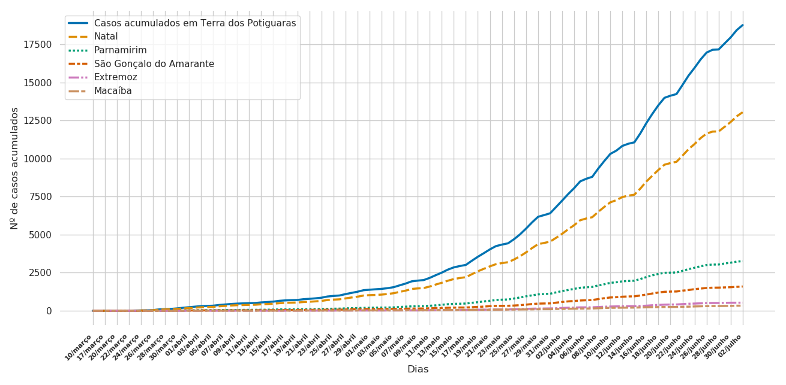
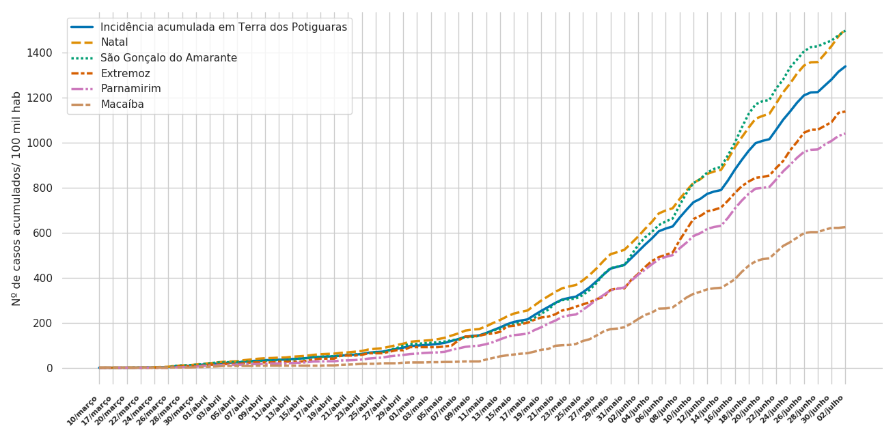
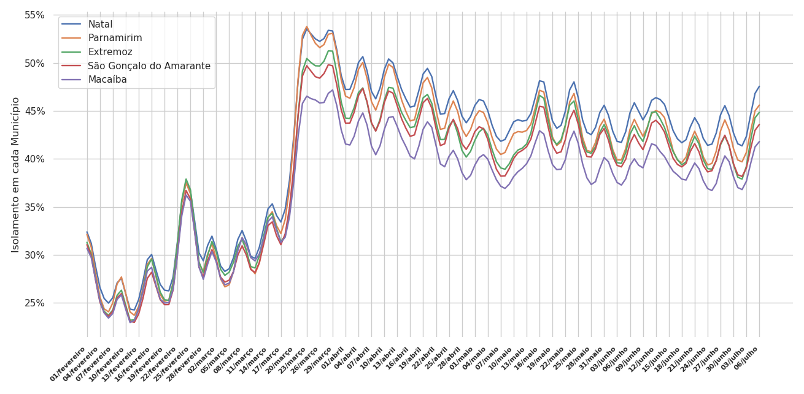
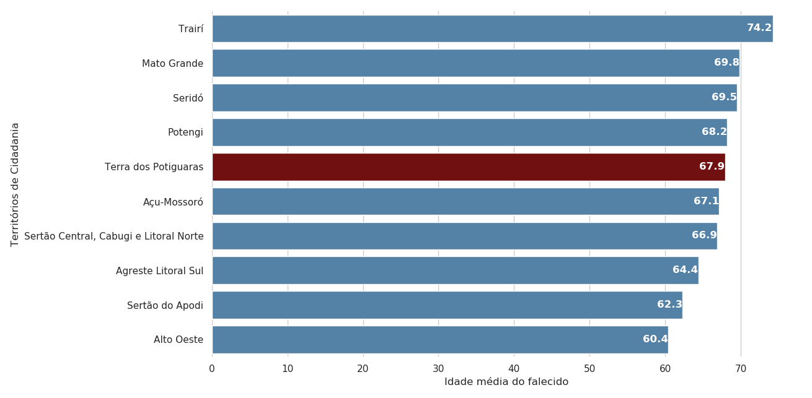
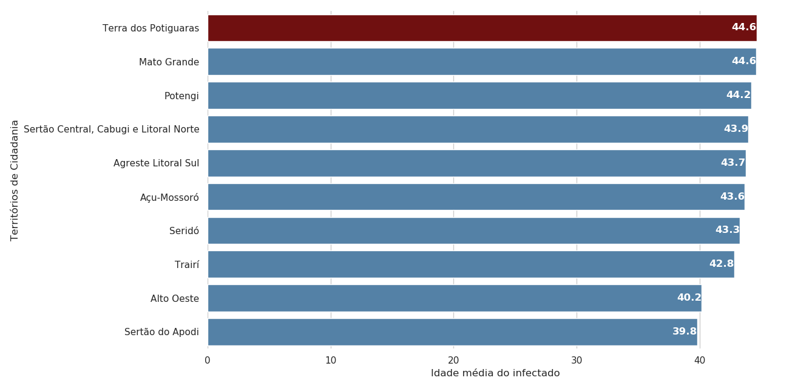
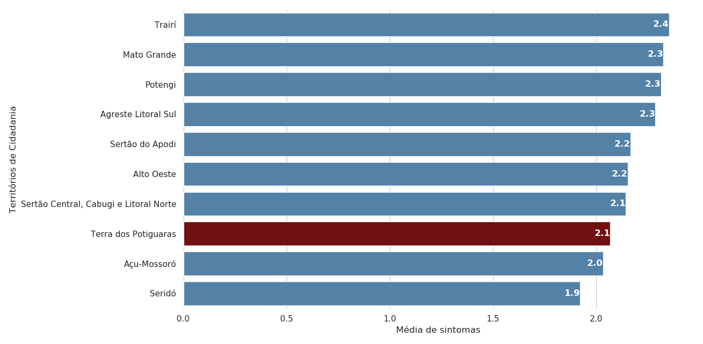
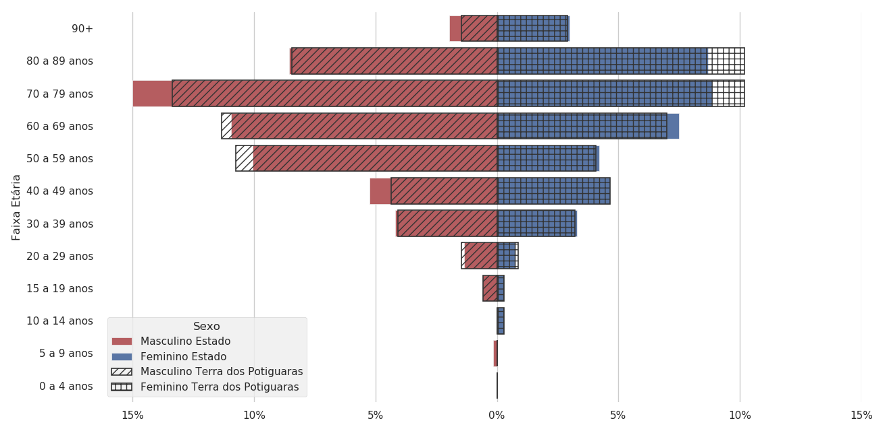
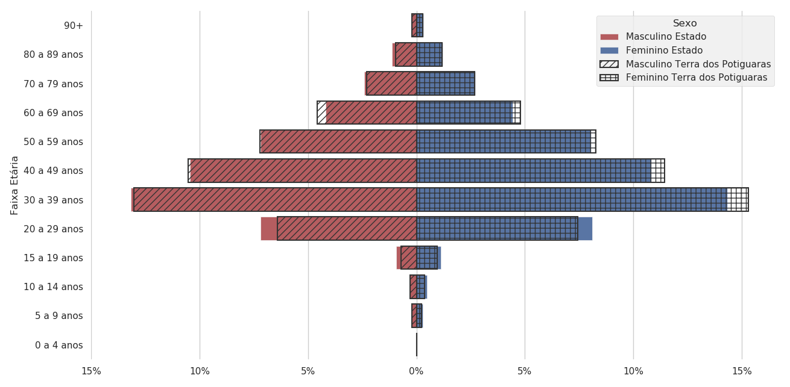
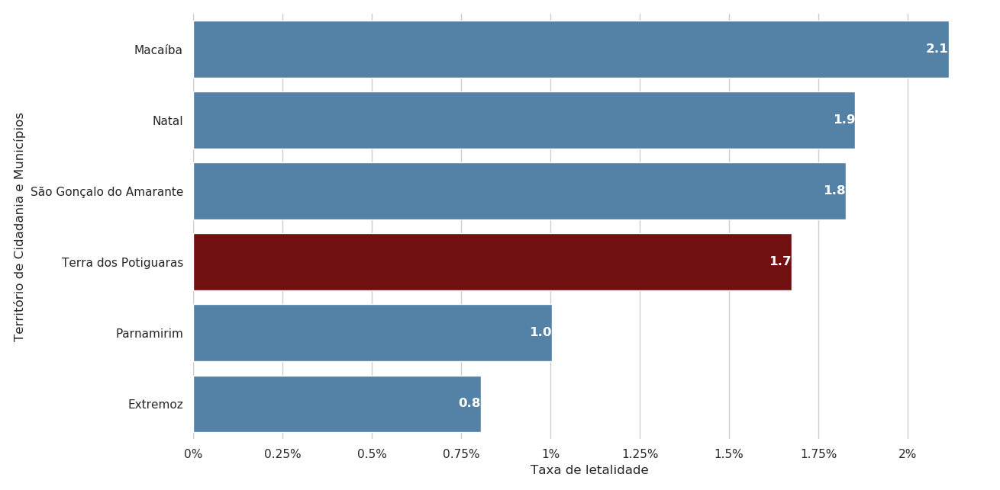

# 
 Data Visualization with Seaborn: using Sesap's COVID-19 database 

due to world wide pandemic disease COVID-19, every country is passing through a chaotic moment, one of them is Brazil. In this repository was used data about the state Rio Grande do Norte (RN). The database used to show statistics about Rio Grande do Norte situation in this repository was Sesap's.
 
To create the graphics, the state Rio Grande do Norte was divided in ten territories: Açu-Mossoró, Agreste Litoral Sul, Alto Oeste, Mato Grande, Potengi, Seridó, Sertão Central, Cabugi e Litoral Norte, Sertão do Apodi, Terras Potiguaras and Traíri.

## Libraries used
* Pandas - was used for data manipulation and extraction.
* Seaborn - was used for data visualization.
* Numpy 

### Where i can find the database?
You can find the database in this link: https://portalcovid19.saude.rn.gov.br/medidas/boletinsepidemiologicos/

## All graphics created 
It will be shown here the graphics for the territory 'Terras Potiguaras' in which it has the great Natal.
* Acumulated Cases of COVID-19

* Acumulated Incidency 

* Social Distancing

* Average age of deceased

* Average age of infected

* Symptom media

* Age pyramid of deceased

* Age pyramid of infected

* Lethality rate

